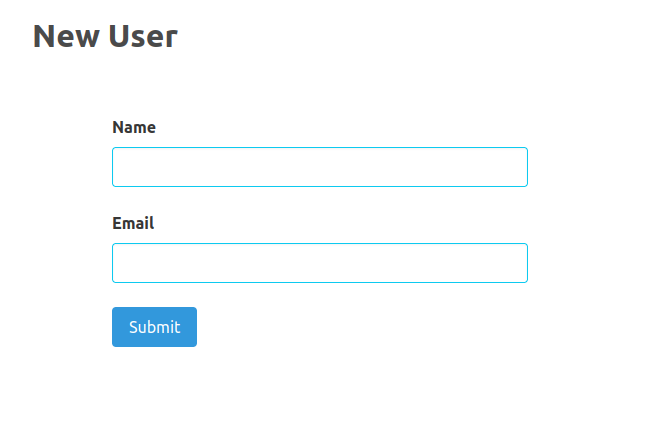
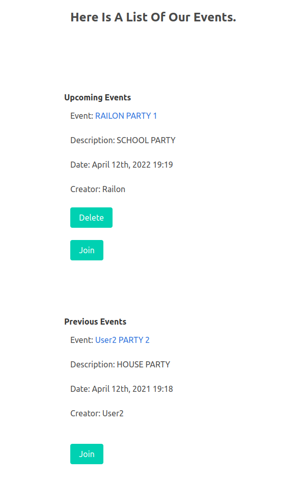
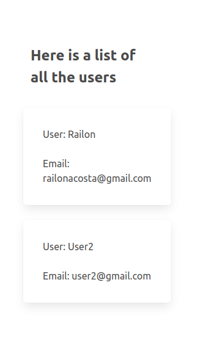
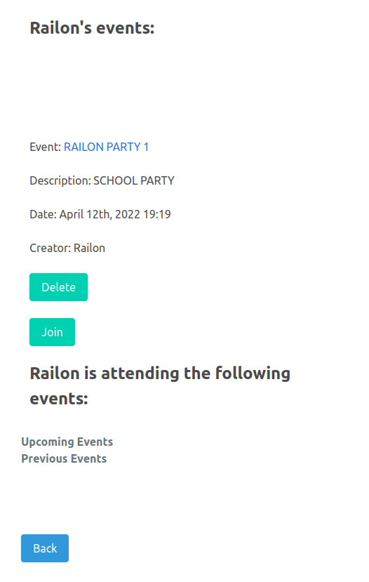

# Private-Events
A rails Members Only project
> In this project, it has been built an application named Private Events that behaves similar to Eventbrite. The main goal was to put in practice the main concepts of Associations in rails. Mainly, given the main character (the user), the events and invitations can be created with the user in mind; the user can attend an event, can create and event, can delete, etc. Find it at https://www.theodinproject.com/paths/full-stack-ruby-on-rails/courses/ruby-on-rails/lessons/associations

## Screenshot
- 
- 
- 
- 

## Built With
- RUBY
- Ruby On Rails
- Visual Code
## GET STARTED
#### Requirements
- At least one code editor installed (VS Code for example)
- Git installed
- Ruby installed
- At least one web browser
#### Clone the repository
- Click on the "code" button above on this page and copy the link to the repository
- Run `git@github.com:RailonA/private-events.git`
- Go to the cloned repository run `cd private-events`
#### Installe required Gem
- In the terminale, run `bundle install`
- [optional] Run `bundle update`
#### Set up the database tables
Run `rails db:migrate` and make sure the commande succeded
#### Test all in the browser
- Run `$ rails server`
- In the browser go to http://localhost:3000/users/new
- This page should display :arrow_down:
- 
- Create a new user by putting informations inside the text fields
#### Test the tables
- First run `rails c`
- In the rails console make sure all the tables are working correctly. Run `User`
- Then look at all User to make sure that information used to create the user account was pushed successfully to the database.
1. `user = User`
2. `pp user.all` shows details of all the users
## :handshake: Contributing
Contributions, issues and feature requests are welcome!
## Author 1
:bust_in_silhouette: **Railon Acosta**
- GitHub: [@railonA](https://github.com/RailonA)
- Linkedin: [@railonAcosta](https://www.linkedin.com/in/railon-acosta-81265180/)
- Twitter: [@railonAcosta](https://twitter.com/RailonAcosta)

## 🤝 Contributing

Contributions, issues, and feature requests are welcome!

Feel free to check the [issues page](https://github.com/RailonA/members_only/issues).

## Acknowledgments

-  

## Show your support

Give a ⭐️ if you like this project!

## 📝 License

This project is MIT licensed.